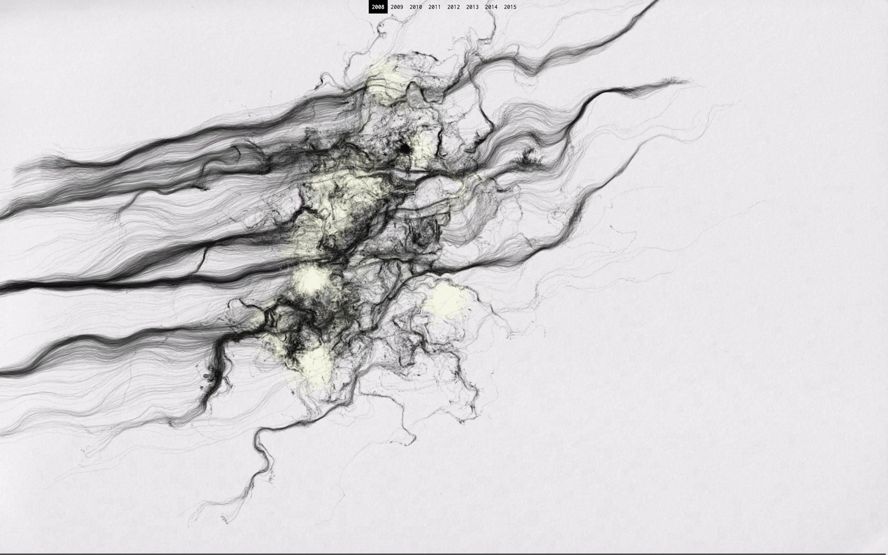

# Data Driven Drawings

[Data Driven Drawings](https://dddrawings.com/) is my PhD dissertation. This repository contains the code for all the practical projects developed for the dissertation.

## TODO

- change default image
- better template for datasets pages (images with link to projects...)
- add more drawings to vista al mar
- fix sound auto-play issue on browsers vista al mar
